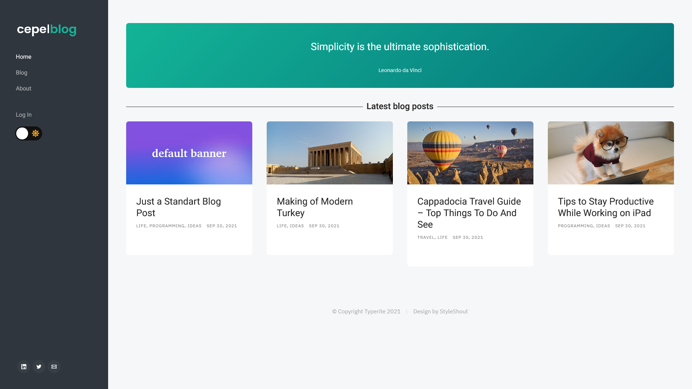
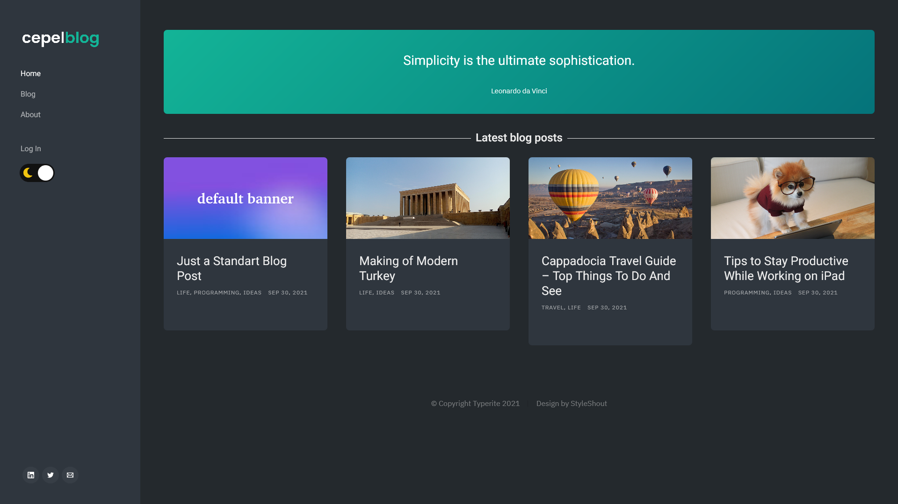

## cepelblog — Flask Web Application for Blogging
**Live on Heroku: http://cepelblog.herokuapp.com/**

#### Test account:
email: test@test.com  
password: 123

### Description
cepelblog is a Flask Web application that allows you to create blog posts, tags and also authenticate users. The blog posts have a rich text editor (CKEditor), and also tags that you can connect.

### Screenshots

### Installation and Usage
1. Install all dependencies listed in requirements.txt - all packages are pip-installable.
2. Run app.py to launch a local Flask server to host the Flask app. A link will appear in your console; click this to use the Dash app.
